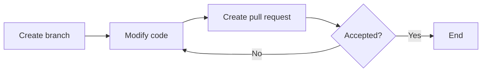

# Diagrams

It is often much easier to explain how a script works or should be used by using a diagram. GitHub includes functionality for easily generating diagrams from a simple `mermaid` syntax.

For example,

````

````

is rendered:


