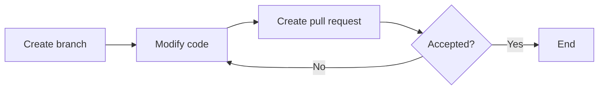

```mermaid
%%{ init: { 'flowchart': { 'curve': 'linearOpen' } } }%%
graph LR;
    A[Create branch]-->B[Modify code];
    B-->C[Create pull request];
    C-->D{Accepted?};
    D-->|Yes|E[End];
		D-->|No|B;
```
